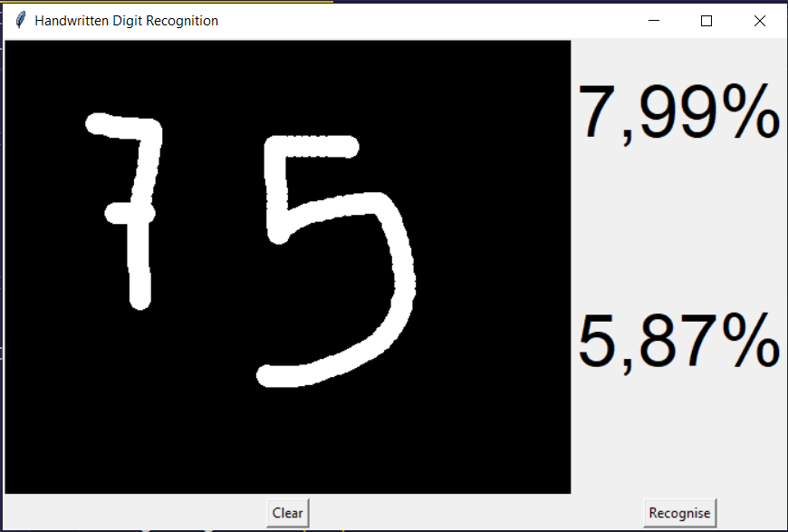

### We are testing on multi digit 

**Used Data Shapes**
```
Shapes of dataset:
Training dataset:
(11528, 28, 56, 1) (11528, 10)

Validation dataset:
(3603, 28, 56, 1) (3603, 10)

Testing dataset:
(2883, 28, 56, 1) (2883, 10)
```


 Layer (type)      |          Output Shape         |     Param #   
---- | ---- | ---- 
 conv2d (Conv2D)        |     (None, 28, 56, 32)     |   320       
 activation (Activation)  |   (None, 28, 56, 32)    |    0   
 conv2d_1 (Conv2D)      |    (None, 28, 56, 32)        | 9248      
 max_pooling2d (MaxPooling2D )  |  (None, 14, 28, 32)     |   0         
 activation_1 (Activation)  |  (None, 14, 28, 32)       |  0      
 conv2d_2 (Conv2D)    |        (None, 14, 28, 64)      |   18496     
 conv2d_3 (Conv2D)       |     (None, 14, 28, 64)       |  36928     
 max_pooling2d_1 (MaxPooling 2D) |   (None, 7, 14, 64)       |  0             
 activation_2 (Activation)  |  (None, 7, 14, 64)    |      0         
 conv2d_4 (Conv2D)         |   (None, 7, 14, 128)    |     73856     

--- 

Total params: 1,279,018

Trainable params: 1,279,018

Non-trainable params: 0

---

### **Result**

